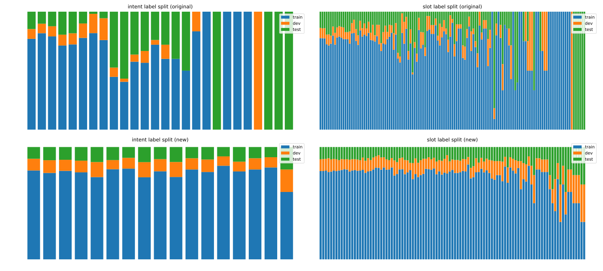

# jython notebooks


### ATIS DS Downloader 

#### new version (fetched from [yvchen/JointSLU](https://github.com/yvchen/JointSLU))
After working for a while with the ATIS dataset, I noticed some issues with 
the data split (see [atis_resplit.ipynb](atis_resplit.ipynb) for details) and decided to resplit it. 



I have also found a text version of the ATIS dataset at [yvchen/JointSLU](https://github.com/yvchen/JointSLU), and used it for the new train/dev/test split (check [atis_resplit.ipynb](atis_resplit.ipynb)).

Both ATIS versions - the one from the MS CNTK and the one from [yvchen/JointSLU](https://github.com/yvchen/JointSLU) are identical (the only difference I spotted is in the prefered tokenization of some words like `I'm` and `I'd`).

The new dataset split however omits some of the data samples (40 in total) containing uncommon slot or intent labels, and also uses different numerical ids for the labels (sorted by usage frequency). The `token_id` 0 is not used, so it could be assigned to a padding symbol if required.

#### old version (fetched from MS CNTK)

After failing to find an ATIS DS including the intent labels 
(the one at [mesnilgr/is13](https://github.com/mesnilgr/is13) does not
include them), 
I've written a kind of a downloader for the ATIS dataset included 
in the [MS CNTK](https://github.com/Microsoft/CNTK). The notebook at:

[ms_cntk_atis_dataset_reader.ipynb](ms_cntk_atis_dataset_reader.ipynb)

would download and store the DS as a pickle that could be used like this:

```python
def load_ds(fname='ms_cntk_atis.train.pkl.gz'):
    with gzip.open(os.path.join(DATA_DIR, fname), 'rb') as stream:
        ds,dicts = pickle.load(stream)
    print('Done  loading: ', fname)
    print('      samples: {:4d}'.format(len(ds['query'])))
    print('   vocab_size: {:4d}'.format(len(dicts['token_ids'])))
    print('   slot count: {:4d}'.format(len(dicts['slot_ids'])))
    print(' intent count: {:4d}'.format(len(dicts['intent_ids'])))
    return ds,dicts
```

, i.e. to show the first few samples:

```python
t2i, s2i, in2i = map(dicts.get, ['token_ids', 'slot_ids','intent_ids'])
i2t, i2s, i2in = map(lambda d: {d[k]:k for k in d.keys()}, [t2i,s2i,in2i])
query, slots, intent =  map(train_ds.get, ['query', 'slot_labels', 'intent_labels'])

for i in range(5):
    print('{:4d}:{:>15}: {}'.format(i, i2in[intent[i][0]],
                                    ' '.join(map(i2t.get, query[i]))))
    for j in range(len(query[i])):
        print('{:>33} {:>40}'.format(i2t[query[i][j]],
                                     i2s[slots[i][j]]  ))
    print('*'*74)
```

